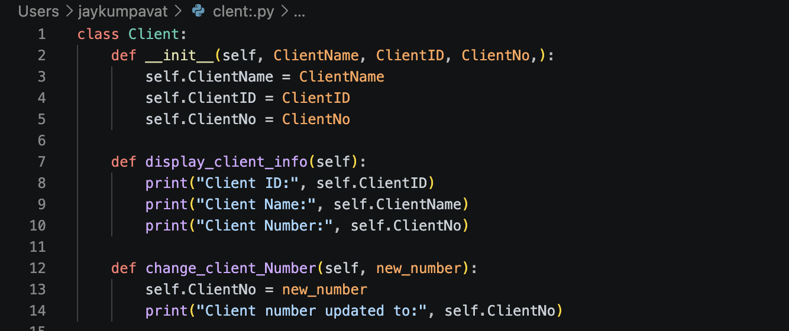
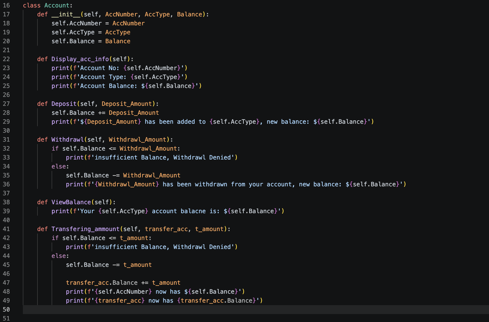
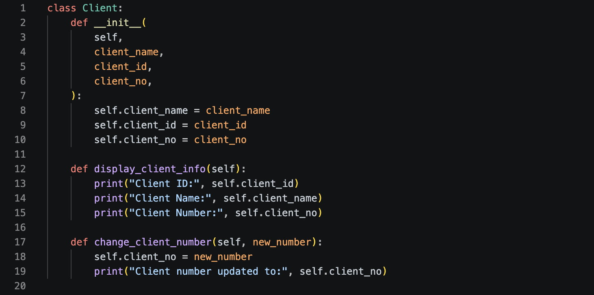
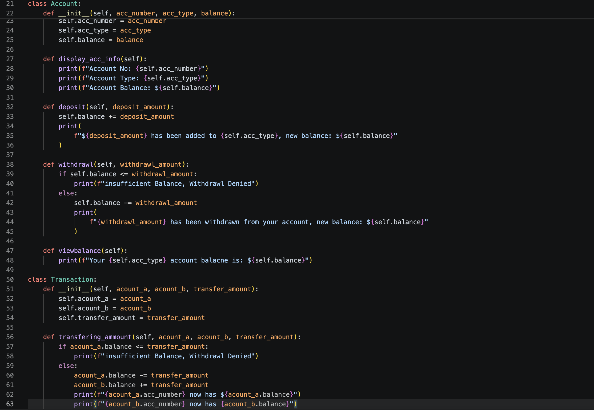
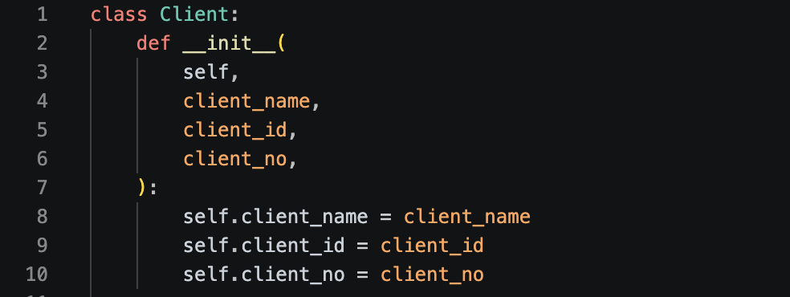
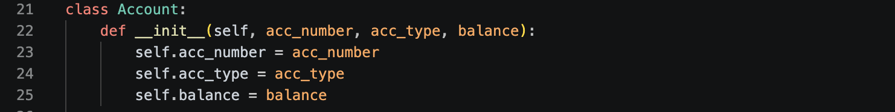
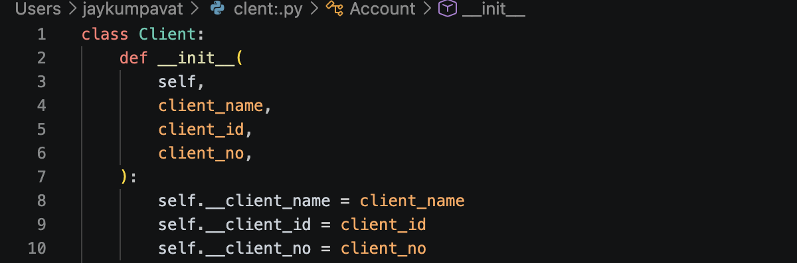
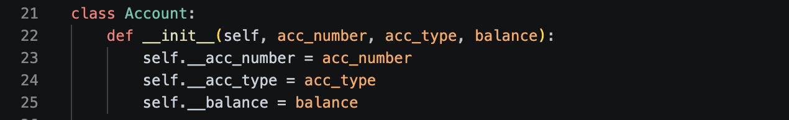

# Code Reviews
No code review was conducted in week 1 as it was not required
No code reivew in extention week (week 4)

Forgot tutors name (pretty sure it was Lance but not 100%) who conducted code review with me but he marked me of on his laptop so I believe I have completed it for week 2 and 3.

## **Week 2**
Feedback:
- make separate class for transferring money from different amounts
- Use pep8 formatting

learning experience:
during the discussion/ code review, my tutor explained why account should only have one responsbility, refering to SOLID's principles. He then talked about how its easier to test the account logic and transaction logic seperatly. He also commented to apply pep8 formatting which I hadn't gotten up to but was prepering to start. I asked him why we should use it and he responded by saying that if your working in a company or with a team, having the same formatting can make reading and editing code easier as everyone is writing very similarly. 

**Evidence of Code Change**

*Before*

*After*

****
## **Week 3**
Feedback:
- explained how str and repr are different and why they are used
- explained how private attributes work and were to implement them in my code 

learning experience:
I was confused at first between str and repr since they both seemed to output the same values, where one is just in sentence form and the other not. The tutor basically explained that str is meant to give a description of an object, in a way the user can read and repr is meant to give a more technical description, generally aimed at a developer. Now with private attributes, he told me to apply them to the attributes that don't want to be changed outside the function or read from outside the function. 

**Evidence of Code Changes**

*Before*

*After*

*note the following images provided in the code review files, I have only taken for account and client. The rest of the changes applied to all othe r classes can be found in the git commit section.

